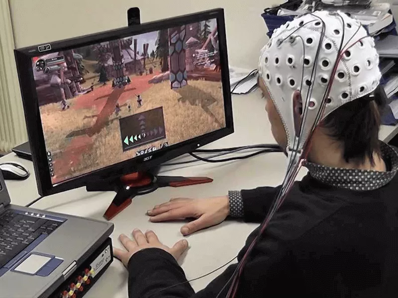

# **Peng Luo**
## **Menu:**
1. [Status](##**Status:**)
2. [Interest](##**Interest:**)
3. [Programming](##**Programming:**)
4. [Contact](##**Contact:**)
## **Status:**
- Job: undergraduate
- University: UCSD
- School Year: 4
- Anticipated Time of Graduation: June/2023

## **Interest:**
1. Fantasy novel
   - Reading *Mistborn* now
2. Non-invasive Brain Computer Interface (BCI)
   - Cool (Maybe) Picture: 

## **Favourite Quote:**
>The unexamined life is not worth living

## **Mostly Used Command Line Code:**
- ``` 
  git status
  ```


## **Programming:**
- Mostly use C/C++

## **Current Goal:**
- [ ] Implement suffix sorting algorithm based on a [paper](
https://doi.org/10.48550/arXiv.1610.08305).
- [ ] Study machine learning in EEG signal processing 

## **Contact:**
- Email: p2luo@ucsd.edu

